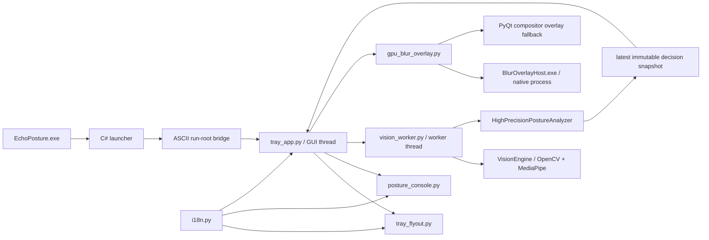

# EchoPosture Architecture

This document describes the current Windows desktop implementation. It is intended to answer four questions quickly:
where execution starts, which component owns each responsibility, how data crosses thread or process boundaries, and
which invariants must be preserved when the application changes.

## System Overview

The application is a mixed Windows stack:

- Python 3.11 and PyQt5 provide the tray runtime and desktop UI.
- OpenCV and MediaPipe provide camera capture and landmark extraction.
- C# provides the lightweight executable launcher and packaged self-test orchestrator.
- C++/D3D11/DXGI/DirectComposition provide the preferred native blur overlay host.

## Entry Points

| Entry | Purpose | Execution path |
| --- | --- | --- |
| `EchoPosture.exe` | Packaged user entry | C# launcher -> embedded `pythonw.exe` -> `tray_app.py` |
| `EchoPostureSelfTest.exe` | Packaged four-stage diagnostic | native host -> debug UI -> one-frame vision -> tray self-test |
| `run_debug_ui.cmd` | Source-tree visual and camera diagnostic | embedded Python -> `debug_ui.py` |
| `run_vision_test.cmd` | Source-tree vision diagnostic | embedded Python -> `vision_test.py` |
| `run_overlay_test.cmd` | Source-tree click-through dimming test | embedded Python -> `overlay_test.py` |
| `build_launcher.cmd` | Windows binary build | C++ blur host build, then C# launcher and self-test build |

The launcher creates `%LOCALAPPDATA%\EchoPostureGA121\current` as a junction to the package. If junction creation is
unavailable, it mirrors the package to `current-copy`; if both operations fail, it runs from the extracted package
directory. The ASCII run root protects MediaPipe and Qt resource loading when the package path contains non-ASCII
characters.

## Component Responsibilities

### Launcher and packaging boundary

`launcher/EchoPostureLauncher.cs`:

- verifies that `runtime/python311/python.exe` exists;
- prepares the ASCII compatibility run root;
- configures Python UTF-8 and Qt plugin environment variables;
- starts `tray_app.py` with `pythonw.exe`, or `debug_ui.py` for `--debug-ui`;
- runs the packaged four-stage diagnostic when invoked as `EchoPostureSelfTest.exe` or with `--self-test`;
- writes the latest packaged self-test report to `logs/self-test-latest.txt` in the original package directory.

The launcher is not a single-file Python packager. A release must include the embedded Python runtime and application
modules alongside the executable.

### Tray coordinator and GUI thread

`tray_app.py` owns application lifecycle and all Qt-facing state:

- system tray icon, onboarding toast, startup calibration dialog, tray flyout, and console window;
- the 10 Hz GUI timer that consumes the latest worker result;
- pause, resume, recalibration, manual max-effect preview, and shutdown;
- intervention gating and calls into the overlay controller;
- user-facing camera and screen-capture warnings.

The GUI thread must not perform continuous camera capture or MediaPipe inference.

### Vision worker thread

`vision_worker.py` owns a daemon worker thread. The worker constructs, uses, and closes `VisionEngine` and performs
posture analysis in that same thread. The GUI thread communicates through:

- a command queue for FPS changes and calibration requests;
- a single-slot latest-value mailbox containing immutable sample and decision dataclasses;
- one-shot error and calibration-result receipts.

Old frames are intentionally overwritten instead of queued. Posture intervention operates on seconds-long state, so
freshness is more important than processing every captured frame.

### Vision extraction and posture decisions

`vision_test.py` contains the domain layer:

- `VisionEngine` opens the camera and produces `VisionSample` values from face and pose landmarks;
- `PostureAnalyzer` provides the basic baseline-threshold model;
- `HighPrecisionPostureAnalyzer` adds risk scoring, sustained-risk tracking, presence checks, and profile-consistency
  protection;
- `PostureDecision` carries status, reason, calibration state, risk score, and sustained duration.

The analyzer produces states such as `GOOD`, `WATCH`, `BAD`, `CRITICAL`, `UNKNOWN`, `AWAY`, `MULTI_USER`, and
`PROFILE_MISMATCH`. These are ergonomic application states, not medical diagnoses or identity recognition.

### Overlay controller and native host

`gpu_blur_overlay.py` is the process boundary between the Python runtime and `BlurOverlayHost.exe`:

- starts the native host with the Python process ID;
- sends newline-delimited JSON commands through standard input;
- reads JSON status and heartbeat messages from standard output on a reader thread;
- forwards target state and visual configuration only when values change;
- falls back to the PyQt compositor overlay if the host is missing, unhealthy, or its pipe fails.

The native host owns full-screen, topmost, click-through windows and prefers Desktop Duplication capture with D3D11
blur. It can fall back internally when desktop capture is unavailable. `Ctrl+Alt+Shift+E` is the emergency clear
hotkey registered by the native host.

### User interfaces and localization

- `tray_flyout.py` provides the right-click tray controls.
- `posture_console.py` provides the OCULI / VERTEBRA console and centralizes feature mappings in `FEATURE_REGISTRY`.
- `onboarding_toast.py` provides the startup opt-in interaction.
- `i18n.py` owns Chinese, English, and follow-system modes plus listener notification.
- `ui/index.html` is a frozen, disconnected visual reference. Production behavior must be implemented in PyQt modules,
  not by wiring the HTML prototype into the runtime.

Language selection, feature toggles, posture baseline, and visual slider values are currently session state. The
application does not persist them to a settings file or registry key. The packaged self-test is the normal operation
that writes a report, under the package-local `logs` directory.

## Runtime Sequences

### Startup and calibration

1. The launcher prepares the run root and starts `tray_app.py`.
2. `TrayMonitor` starts `VisionWorker` and waits up to 15 seconds for the camera handshake.
3. The tray icon appears and the onboarding toast asks the user to enable monitoring.
4. A five-second calibration dialog is shown while the worker samples at 180 ms intervals.
5. The worker averages usable samples and asks the analyzer to set its baseline.
6. A successful result starts monitoring; a failed startup calibration shows a warning and stops the application.

### Monitoring and intervention

1. The worker captures a frame, extracts a `VisionSample`, evaluates it, and replaces the mailbox snapshot.
2. The GUI timer reads the newest snapshot without blocking the worker.
3. Intervention is eligible only for `BAD` or `CRITICAL`, risk score at least `45`, sustained risk at least `12`
   seconds, followed by another `3` seconds of continuous confirmation.
4. `GpuBlurOverlayController` activates the native host or the fallback overlay.
5. Returning to a non-risk state clears the candidate timer and deactivates the overlay.

The manual max-effect command bypasses posture gating for an eight-second preview but uses the same overlay controller.

### Shutdown

`TrayMonitor.stop()` is idempotent. It stops timers, closes transient windows, clears and closes the overlay, asks the
worker to stop and join, hides the tray icon, and quits Qt. Changes that can bypass this sequence risk leaving a camera
handle, overlay window, or helper process behind.

## Architectural Invariants

Preserve these rules unless an intentional architecture change is documented and tested:

1. `VisionEngine` is constructed, called, and closed on the worker thread during normal operation. Analyzer evaluation
   and baseline calibration also run there; GUI feature controls are limited to simple configuration flags.
2. Worker code never touches Qt widgets; GUI code consumes immutable snapshots and one-shot receipts.
3. The GUI event loop must remain non-blocking during capture, inference, calibration, and overlay status handling.
4. Pausing, recalibrating, camera failure, and shutdown must clear active visual intervention.
5. The native overlay must remain click-through and must retain an emergency clear path.
6. Missing or failed native blur must degrade to the fallback instead of terminating posture monitoring.
7. User-facing text belongs in `i18n.py`; language listeners must be added and removed with widget lifetime.
8. `ui/index.html` remains a frozen reference unless the task explicitly targets the reference itself.
9. Release code and package metadata must use the same version, ASCII bridge label, tag, asset name, and checksum.

## Change Map and Test Map

| Change area | Primary files | Minimum focused verification |
| --- | --- | --- |
| Camera extraction or scoring | `vision_test.py` | `python -m py_compile ...`, `test_vision_worker.py`, relevant camera diagnostic |
| Worker lifecycle or calibration | `vision_worker.py`, `tray_app.py` | `test_vision_worker.py`, `test_startup_guards.py` |
| Tray flyout | `tray_flyout.py`, `i18n.py` | `test_tray_flyout.py`, `test_startup_guards.py` |
| Console switches | `posture_console.py`, `vision_test.py`, `gpu_blur_overlay.py` | `test_feature_toggles.py` plus focused manual console check |
| Overlay controller | `gpu_blur_overlay.py`, `debug_ui.py` | native self-test, overlay clear/fallback check |
| Native host | `native/BlurOverlayHost.cpp` | `build_blur_overlay_host.cmd`, `BlurOverlayHost.exe --self-test` |
| Launcher or package startup | `launcher/EchoPostureLauncher.cs` | `build_launcher.cmd`, packaged `EchoPostureSelfTest.exe` |
| User-facing text | `i18n.py` and consuming UI | syntax checks, relevant logic test, manual Chinese/English refresh |

See [Contributing](../CONTRIBUTING.md) for the complete validation workflow and [Release Guide](RELEASE.md) for package
and publication checks.
