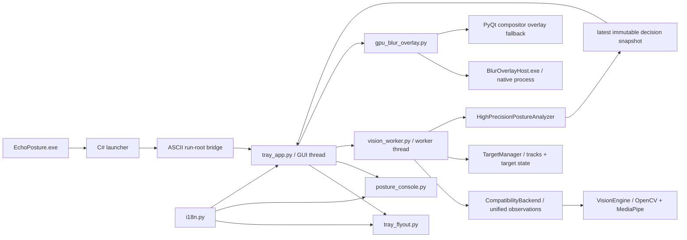

# EchoPosture Architecture

This document describes the current Windows desktop implementation. It is intended to answer four questions quickly:
where execution starts, which component owns each responsibility, how data crosses thread or process boundaries, and
which invariants must be preserved when the application changes.

## System Overview

```mermaid
flowchart LR
    EXE[EchoPosture.exe] --> Launcher[C# launcher]
    Launcher --> Bridge[ASCII run-root bridge]
    Bridge --> Tray[tray_app.py / GUI thread]

    Tray --> Flyout[tray_flyout.py]
    Tray --> Console[posture_console.py]
    Tray --> Worker[vision_worker.py / worker thread]
    Worker --> Backend[CompatibilityBackend / unified observations]
    Backend --> Engine[VisionEngine / OpenCV + MediaPipe]
    Worker --> Target[TargetManager / tracks + target state]
    Worker --> Analyzer[HighPrecisionPostureAnalyzer]
    Analyzer --> Snapshot[latest immutable decision snapshot]
    Snapshot --> Tray

    Tray --> OverlayCtl[gpu_blur_overlay.py]
    OverlayCtl --> Host[BlurOverlayHost.exe / native process]
    OverlayCtl --> Fallback[PyQt compositor overlay fallback]

    I18N[i18n.py] --> Flyout
    I18N --> Console
    I18N --> Tray
```

The application is a mixed Windows stack:

- Python 3.11 and PyQt5 provide the tray runtime and desktop UI.
- OpenCV and MediaPipe provide camera capture and landmark extraction.
- C# provides the lightweight executable launcher and packaged self-test orchestrator.
- C++/D3D11/DXGI/DirectComposition provide the preferred native blur overlay host.

## Entry Points

| Entry | Purpose | Execution path |
| --- | --- | --- |
| `EchoPosture.exe` | Packaged user entry | C# launcher -> embedded `pythonw.exe` -> `tray_app.py` |
| `EchoPostureSelfTest.exe` | Packaged four-stage diagnostic | native host -> debug UI -> one-frame vision -> tray self-test |
| `run_debug_ui.cmd` | Source-tree visual and camera diagnostic | embedded Python -> `debug_ui.py` |
| `run_vision_test.cmd` | Source-tree vision diagnostic | embedded Python -> `vision_test.py` |
| `run_overlay_test.cmd` | Source-tree click-through dimming test | embedded Python -> `overlay_test.py` |
| `build_launcher.cmd` | Windows binary build | C++ blur host build, then C# launcher and self-test build |

The launcher creates `%LOCALAPPDATA%\EchoPostureGA121\current` as a junction to the package. If junction creation is
unavailable, it mirrors the package to `current-copy`; if both operations fail, it runs from the extracted package
directory. The ASCII run root protects MediaPipe and Qt resource loading when the package path contains non-ASCII
characters.

## Component Responsibilities

### Launcher and packaging boundary

`launcher/EchoPostureLauncher.cs`:

- verifies that `runtime/python311/python.exe` exists;
- prepares the ASCII compatibility run root;
- configures Python UTF-8 and Qt plugin environment variables;
- starts `tray_app.py` with `pythonw.exe`, or `debug_ui.py` for `--debug-ui`;
- runs the packaged four-stage diagnostic when invoked as `EchoPostureSelfTest.exe` or with `--self-test`;
- writes the latest packaged self-test report to `logs/self-test-latest.txt` in the original package directory.

The launcher is not a single-file Python packager. A release must include the embedded Python runtime and application
modules alongside the executable.

### Tray coordinator and GUI thread

`tray_app.py` owns application lifecycle and all Qt-facing state:

- system tray icon, onboarding toast, startup calibration dialog, tray flyout, and console window;
- the 10 Hz GUI timer that consumes the latest worker result;
- pause, resume, recalibration, manual max-effect preview, and shutdown;
- intervention gating and calls into the overlay controller;
- user-facing camera and screen-capture warnings.

The GUI thread must not perform continuous camera capture or MediaPipe inference.

### Vision worker thread

`vision_worker.py` owns a daemon worker thread. The worker constructs, uses, and closes `VisionEngine` and performs
posture analysis in that same thread. The GUI thread communicates through:

- a command queue for FPS changes and calibration requests;
- a single-slot latest-value mailbox containing immutable sample and decision dataclasses;
- one-shot error and calibration-result receipts.

Old frames are intentionally overwritten instead of queued. Posture intervention operates on seconds-long state, so
freshness is more important than processing every captured frame.

### Vision extraction and posture decisions

`vision_test.py` contains the domain layer:

- `VisionEngine` opens the camera and produces `VisionSample` values from face and pose landmarks;
- `PostureAnalyzer` provides the explicitly legacy baseline-threshold model for debug/self-test compatibility;
- `posture_science.py` owns two-anchor statistics (mean/std/n/SEM/MDC/CV), continuous within-person deviation,
  group de-duplication, and real-time exposure accumulation;
- `HighPrecisionPostureAnalyzer` uses the scientific profile in production, while retaining the legacy path behind an
  explicit compatibility flag; presence and profile-consistency protection remain independent;
- `PostureDecision` carries posture deviation, equivalent exposure seconds, confidence, calibration quality, activity
  state, and the old `risk_score` / `sustained_seconds` compatibility aliases.

The analyzer produces states such as `GOOD`, `MOVING`, `ADJUSTING`, `OBSERVING`, `WATCH`, `BAD`, `CRITICAL`,
`UNKNOWN`, `AWAY`, `MULTI_USER`, and `PROFILE_MISMATCH`. `MOVING` and `ADJUSTING` are measured activity states;
`OBSERVING` keeps a known target visible while one frame is not eligible for exposure. `UNKNOWN` is reserved for
genuinely unavailable posture measurements or unresolved targets. These are ergonomic application states, not
medical diagnoses or identity recognition.

### Unified backend and target management

`vision_backend.py` defines model-independent `PersonObservation`, `VisionCapabilities`, `VisionBackend`, and
`PostureFeatureExtractor` contracts. `CompatibilityBackend` wraps the current MediaPipe engine, preserves
`VisionSample` output for the posture analyzer, and publishes a unified observation for target management. The worker
reconstructs the analyzer sample from the selected target observation, so a future multi-person backend cannot score a
bystander's posture just because it was returned in the same frame. Because MediaPipe Pose is single-person, a frame
with multiple faces cannot prove which face belongs to its one body; the adapter marks that observation ambiguous
instead of combining the first face with the pose. Even with one face, the adapter requires a face anchor inside the
expanded body envelope; a missing or out-of-envelope anchor is marked ambiguous rather than guessed.

`vision_tracking.py` owns `TargetManager`. It associates observations using stable detection IDs when available,
predicted motion, center distance, and bounding-box overlap; maintains track lifetimes; locks the calibration target;
and emits `TARGET_LOCKED`, `MULTI_PRESENT`, `TARGET_OCCLUDED`, `TARGET_REACQUIRING`, `IDENTITY_UNCERTAIN`, `AWAY`, or
`TARGET_AMBIGUOUS`. Frame association is global one-to-one: predicted motion is scored with box overlap and area
continuity, while near-tied candidates enter `TARGET_AMBIGUOUS`; immutable track output carries the last match score.
A non-target track is never promoted automatically. When a backend can keep the target observation
separate, `MULTI_PRESENT` is attached to the immutable worker snapshot while posture scoring continues for the target.
The locked target also publishes a time-normalized motion value and `STATIC` / `MOVING` activity state. It combines
smoothed box-centre translation with signed relative box-scale velocity, so forward/backward movement can be detected
without turning alternating scale jitter into activity. Motion does not accumulate static exposure.

### Scientific calibration and measurement abstention

Production calibration uses explicit phases. The visible dialog stays open for five seconds and every sample in that
window belongs only to the preferred comfortable anchor. After the dialog closes, the tray tells the user that they may
relax; about one second of transition samples is ignored, then the worker collects the relaxed anchor in the background for about
five seconds. If fewer than five valid relaxed samples are available at the nominal target, collection may extend by at
most two seconds. Each anchor needs at least five complete, single-person, quality-gated samples. A multi-person or
ambiguous observation clears only the active anchor window because it can contaminate identity. A low-quality, moving,
temporarily uncertain, or missing-keypoint observation abstains for that frame without erasing earlier accepted
samples; transition observations neither count nor reset a window. Landmark quality is feature-specific: low hip
visibility disables hip-dependent torso evidence for that observation but does not discard reliable face/shoulder
evidence. The calibration-only shoulder usability floor is `0.30`, allowing a five-second repeatability window to
assess stable edge-of-frame landmarks instead of discarding every frame before statistics exist. Runtime intervention
confidence remains `0.65`, and hip-dependent features retain their separate `0.50` landmark floor. Repeatability is
evaluated per feature through SEM/MDC rather than an unvalidated stricter whole-frame cutoff. The worker applies the
resulting `CalibrationProfile` only after the target manager locks one unambiguous track.
`set_baseline_from_sample()` remains available only for explicit legacy debugging/self-test.

The posture score uses scale-relative face/shoulder and torso/shoulder ratios, optional ear/shoulder position,
pelvis-relative shoulder asymmetry, and pelvis-relative trunk lean. Using the pelvis rather than the image axes keeps
lateral posture evidence unchanged when the whole camera frame rolls. Runtime extraction repeats the feature-local
landmark gate used during calibration:
shoulder evidence may remain usable while low-confidence hips remove only torso/hip-dependent features, and decision
confidence is computed from the features that actually reached scoring. Raw shoulder width and distance remain
separate environment prompts. A uniform whole-person scale change preserves normalized posture evidence and remains
measurable at the new distance. A shoulder-span change is suppressed only when it manufactures corroborated ratios
without corresponding raw numerator changes. Turned-head, low-confidence, moving, camera-reference, and partial
evidence observations pause exposure and use explicit `MOVING`, `ADJUSTING`, or `OBSERVING` states; they do not claim
that the person is unrecognized. Truly absent posture features or unresolved target ownership can still use `UNKNOWN`.

The preferred and relaxed anchors are both user-accepted postures. For each enabled feature, the calibrated interval
between their ordered means is a personal normal band with deviation `0.0`. Similar or identical anchors remain a
valid narrow range; calibration never requires the user to manufacture posture separation. Scoring begins only after
an observation passes either range boundary by more than the runtime measurement-noise band and natural-movement
margin. After the profile is accepted, the
target-locked runtime stream must stay inside that band for about two stable seconds before exposure is enabled. This
validation returns `OBSERVING`, reports zero deviation, and pauses exposure; it guards the adapter/target-replacement
boundary and prevents the relaxed calibration ending pose from creating an exposure episode. Runtime
single-frame measurement noise uses the largest of reported MDC, `3.0 ×` within-anchor standard deviation, and a
conservative per-feature resolution floor (`0.025` for normalized ratios, `2.5°` for angle features). The runtime
acceptance boundary then adds a separate natural-movement deadband (`0.05` for normalized ratios, `3°` for angle
features). SEM/MDC remains in the audit
report, but is not treated as the full single-observation noise band or as an anchor-separation gate. Beyond the
accepted range, noise band, and movement margin, normalized ratios use a fixed `0.10` response scale and angle features a fixed `10°`
response scale. These mappings are independent of anchor spacing, so a narrow range cannot amplify ordinary jitter.
Small uncorroborated deviations remain `GOOD`; a corroborated change must persist for about two seconds in
`ADJUSTING` before entering WATCH, and the adjustment interval is never backfilled as exposure. WATCH hysteresis
remains available for observation, but exposure integrates only while alert hysteresis is active at
deviation `0.70` or above; WATCH-only drift cannot accumulate an alert budget. Observation gaps longer than two
seconds pause integration instead of backfilling unobserved time. These floors, multipliers, and durations are
adjustable product policy, not biological standards.

A pronounced pelvis-relative trunk lean may be the sole lateral evidence when the shoulder line remains parallel;
the explicit `lone_trunk_lean_deviation` policy gate prevents small one-feature jitter from opening WATCH while
preserving real side-reclining. Static-hold time is a bounded add-on only for an already corroborated, confirmed
deviation. It starts after the adjustment window, ramps after about 60 seconds, caps at `0.12`, and resets on
movement, recovery, low quality, or observation gaps; normal posture never earns static-hold score by elapsed time.

### Overlay controller and native host

`gpu_blur_overlay.py` is the process boundary between the Python runtime and `BlurOverlayHost.exe`:

- starts the native host with the Python process ID;
- sends newline-delimited JSON commands through standard input;
- reads JSON status and heartbeat messages from standard output on a reader thread;
- forwards target state and visual configuration only when values change;
- falls back to the PyQt compositor overlay if the host is missing, unhealthy, or its pipe fails.

The native host owns full-screen, topmost, click-through windows and prefers Desktop Duplication capture with D3D11
blur. It can fall back internally when desktop capture is unavailable. `Ctrl+Alt+Shift+E` is the emergency clear
hotkey registered by the native host.

### User interfaces and localization

- `tray_flyout.py` provides the right-click tray controls.
- `posture_console.py` provides the OCULI / VERTEBRA console and centralizes feature mappings in `FEATURE_REGISTRY`.
- `onboarding_toast.py` provides the startup opt-in interaction.
- `i18n.py` owns Chinese, English, and follow-system modes plus listener notification.
- `ui/index.html` is a frozen, disconnected visual reference. Production behavior must be implemented in PyQt modules,
  not by wiring the HTML prototype into the runtime.

Language selection, feature toggles, posture baseline, and visual slider values are currently session state. The
application does not persist them to a settings file or registry key. The packaged self-test is the normal operation
that writes a report, under the package-local `logs` directory.

## Runtime Sequences

### Startup and calibration

1. The launcher prepares the run root and starts `tray_app.py`.
2. `TrayMonitor` starts `VisionWorker` and waits up to 15 seconds for the camera handshake.
3. The tray icon appears and the onboarding toast asks the user to enable monitoring.
4. A five-second calibration dialog is shown while the worker collects only the preferred anchor at 180 ms intervals.
5. The dialog closes before the user is told to relax. The worker ignores an approximately one-second transition and
   samples the relaxed anchor in the background for approximately five seconds, with at most two seconds of bounded extension.
6. `CalibrationAccumulator` builds per-feature repeatability statistics and `CalibrationProfile`; the analyzer accepts
   it only when both stages meet the minimum and at least one posture feature has five valid values in both stages.
7. A successful result starts monitoring immediately with both anchors and their interval treated as the personal
   normal posture range; a failed startup calibration shows a warning and stops the application.

### Monitoring and intervention

1. The worker captures a frame, extracts a `VisionSample`, evaluates it, and replaces the mailbox snapshot.
2. The GUI timer reads the newest snapshot without blocking the worker.
3. Intervention is eligible only for a quality-valid `BAD`/`CRITICAL` scientific decision, deviation at least `0.70`,
   equivalent exposure at least `12` seconds, followed by another `3` seconds of continuous confirmation. A completed
   episode has a `60` second cooldown; these are product policy values, not medical thresholds.
4. `GpuBlurOverlayController` activates the native host or the fallback overlay.
5. Returning to a non-risk state ends the intervention episode; exposure decays gradually and the overlay deactivates.

The manual max-effect command bypasses posture gating for an eight-second preview but uses the same overlay controller.

### Shutdown

`TrayMonitor.stop()` is idempotent. It stops timers, closes transient windows, clears and closes the overlay, asks the
worker to stop and join, hides the tray icon, and quits Qt. Changes that can bypass this sequence risk leaving a camera
handle, overlay window, or helper process behind.

## Architectural Invariants

Preserve these rules unless an intentional architecture change is documented and tested:

1. `VisionEngine` is constructed, called, and closed on the worker thread during normal operation. Analyzer evaluation
   and baseline calibration also run there; GUI feature controls are limited to simple configuration flags.
2. Worker code never touches Qt widgets; GUI code consumes immutable snapshots and one-shot receipts.
3. The GUI event loop must remain non-blocking during capture, inference, calibration, and overlay status handling.
4. Pausing, recalibrating, camera failure, and shutdown must clear active visual intervention.
5. The native overlay must remain click-through and must retain an emergency clear path.
6. Missing or failed native blur must degrade to the fallback instead of terminating posture monitoring.
7. User-facing text belongs in `i18n.py`; language listeners must be added and removed with widget lifetime.
8. `ui/index.html` remains a frozen reference unless the task explicitly targets the reference itself.
9. Release code and package metadata must use the same version, ASCII bridge label, tag, asset name, and checksum.
10. Target tracking may retain or suspend the calibrated target, but it must never promote another active track without
    explicit identity confirmation.
11. Compatibility mode must emit `TARGET_AMBIGUOUS` whenever its single pose cannot be associated with exactly one
    face; ambiguous observations must not reach normal posture scoring.

## Change Map and Test Map

| Change area | Primary files | Minimum focused verification |
| --- | --- | --- |
| Camera extraction or scoring | `vision_test.py` | `python -m py_compile ...`, `test_vision_worker.py`, relevant camera diagnostic |
| Vision backend contract | `vision_backend.py`, `vision_worker.py` | `test_vision_tracking.py`, `test_vision_worker.py` |
| Target association or state | `vision_tracking.py`, `vision_test.py` | `test_vision_tracking.py`, `test_feature_toggles.py` |
| Worker lifecycle or calibration | `vision_worker.py`, `tray_app.py` | `test_vision_worker.py`, `test_startup_guards.py` |
| Tray flyout | `tray_flyout.py`, `i18n.py` | `test_tray_flyout.py`, `test_startup_guards.py` |
| Console switches | `posture_console.py`, `vision_test.py`, `gpu_blur_overlay.py` | `test_feature_toggles.py` plus focused manual console check |
| Overlay controller | `gpu_blur_overlay.py`, `debug_ui.py` | native self-test, overlay clear/fallback check |
| Native host | `native/BlurOverlayHost.cpp` | `build_blur_overlay_host.cmd`, `BlurOverlayHost.exe --self-test` |
| Launcher or package startup | `launcher/EchoPostureLauncher.cs` | `build_launcher.cmd`, packaged `EchoPostureSelfTest.exe` |
| User-facing text | `i18n.py` and consuming UI | syntax checks, relevant logic test, manual Chinese/English refresh |

See [Contributing](../CONTRIBUTING.md) for the complete validation workflow and [Release Guide](RELEASE.md) for package
and publication checks.
