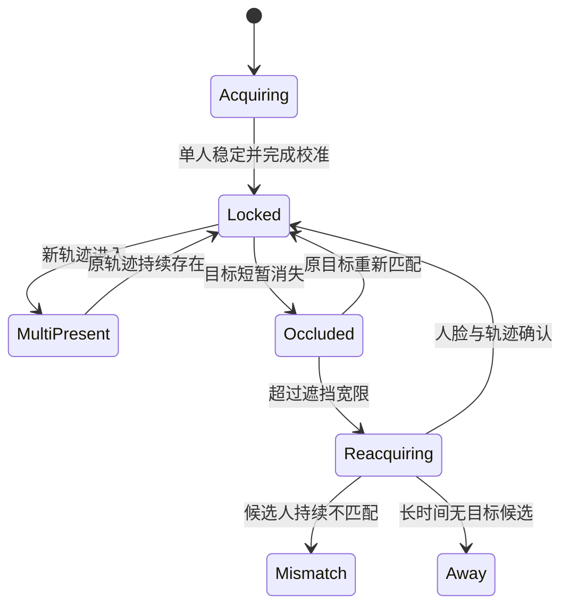

# EchoPosture 多模式视觉、多人跟踪与人脸 ID 升级方案

> 文档状态：方案草案，可直接拆分为开发任务  
> 编制日期：2026-08-08  
> 目标仓库：[NOVVLA/EchoPosture](https://github.com/NOVVLA/EchoPosture)  
> 当前许可证：`AGPL-3.0-only`；项目已接受严格 AGPLv3 约束。该接受只解除项目代码与 YOLO26 的组合许可冲突，权重、训练数据和发行包仍须逐项审计。

## 1. 文档目的

本文汇总并固化 EchoPosture 下一阶段已经讨论确定的方向，包括：

- 三档视觉模式；
- 新姿态模型方案；
- 多人检测与主用户持续跟踪；
- 专用本地人脸 ID 验证；
- 隐私、数据控制和第三方模型致谢；
- 可直接转为 GitHub Issue 的阶段任务与验收标准。

本文不代表所有型号和阈值已经冻结。凡标记为“候选”或“待验证”的内容，必须经过真实摄像头数据、性能测试和许可审计后再进入正式发行版。

## 2. 已确定的产品原则

1. 保留当前模型，作为最低硬件需求的兼容模式。
2. 新增标准模式并设为默认模式，在普通 CPU 上实现明显优于现状的多人姿态能力。
3. 新增专业模式 Beta，面向高性能 GPU，使用项目能够提供的最高精度方案。
4. 三种模式尽可能共享同一套多人目标管理、身份状态机和风险评分语义。
5. 多人出现时，不应简单停止监测；只要原用户轨迹仍然存在，就应继续监测原用户。
6. “始终没有离开画面的轨迹”是主用户判别的重要证据，但不能成为唯一证据。
7. 姿态模型负责发现、定位和跟踪人物；专用人脸模型负责确认“当前目标是否仍为校准用户”。
8. 人脸 ID 验证是低频、事件驱动任务，优先追求准确率而不是每帧速度，可以采用大型模型。
9. 身份不确定时宁可暂停姿态干预，也不能静默把另一人当成原用户。
10. 人脸图像和身份模板受用户控制；项目不主张所有权或次级使用权，不上传、不用于训练或广告。
11. 项目不对引用的第三方模型、论文、商标和原始实现主张所有权，并在专门文档中完整署名、列出许可证并致谢。

## 3. 当前实现基线

当前 `vision_test.py` 同时运行两条 MediaPipe 管线：

| 功能 | 当前实现 | 主要局限 |
| --- | --- | --- |
| 人脸关键点 | MediaPipe Face Mesh，`max_num_faces=2`、`refine_landmarks=True` | 能发现两张脸，但没有稳定人物 ID |
| 身体姿态 | MediaPipe Pose / BlazePose GHUM 3D，`model_complexity=0` | 只跟踪一个主要人物，属于最轻量档 |
| 多人判断 | `face_count > 1` 立即输出 `MULTI_USER` | 无防抖；第二人出现即抑制正常评分 |
| 换人判断 | 离开/多人后比较瞳距-肩宽比和躯干-肩宽比 | 特征弱、单帧通过、容易漏报或误报 |
| 校准 | 后台收集可用指标并平均 | 未严格拒绝多人校准，可能混合不同人物指标 |

现有实现继续承担兼容和回退职责，不直接删除。

2026-08-14 复核：上表是方案编制时的旧基线，不再代表当前代码。兼容后端现已接入统一人物观测、`TargetManager`、目标锁定/歧义状态、双锚点校准和科学姿态分析器；Standard 已在源码 Debug UI 接入真实本地 YOLO26n-pose CPU 后端，可分别输出多个人体框和 17 点骨架。Compatibility 与 Standard 现在都经过统一 `FaceEnhancedBackend`、脸身归属、目标 FaceMesh 五点和本地 CVLFace 身份复核边界。Professional 仍只有模式契约和不可用入口。正式托盘/EXE 仍固定使用 Compatibility。当前跟踪活动量仅来自目标人体框的归一化中心平移速度与尺度变化速度，不能证明用户完全没有移动。

## 4. 三档视觉模式

| 模式 | 姿态后端 | 人脸关键点 | 人脸 ID 验证 | 目标设备 | 产品定位 |
| --- | --- | --- | --- | --- | --- |
| 兼容模式 | 当前 BlazePose Lite | 统一 BlazeFace + 目标 FaceMesh 五点 | 与其他模式共用本地 CVLFace；仅关键事件调用 | 老 CPU、无可用 GPU | 正式托盘/EXE 的现有基线 |
| 标准模式（目标默认；当前 Debug UI 可选） | YOLO26n-pose；首版 Ultralytics PyTorch CPU，后续用实测决定是否导出 ONNX | 与兼容模式共用统一人脸增强边界 | 与兼容模式共用本地 CVLFace；会话内模板和 embedding 不持久化 | 普通现代 Windows 电脑 | 源码 Debug UI 多人姿态原型；正式 EXE 后接 |
| 专业模式 Beta | YOLO26l/x-pose，优先 TensorRT FP16；按显存和实测自动选择 | 高质量目标人脸对齐 | 主验证器；可增加第二模型共识和视频聚合 | RTX 级 GPU | 最高精度、实验性功能 |

### 4.1 兼容模式

- 保留当前 MediaPipe Pose 和 FaceMesh。
- 加入新的轨迹、遮挡、重新捕获和身份复核状态机。
- 多人时可以继续跟踪原用户的人脸轨迹。
- 由于身体模型仍为单人模型，只有当唯一姿态与目标人脸空间关联明确时才继续姿态评分。
- 无法确认脸与身体归属时输出 `TARGET_AMBIGUOUS`，而不是使用 FaceMesh 的第一张脸与 Pose 的单一骨架强行组合。

### 4.2 标准模式

- 默认候选模型：`YOLO26n-pose`。
- 优先导出为 ONNX，避免把完整训练框架作为持续推理依赖。
- 原生输出每个人的人体框、17 个 COCO 身体关键点和置信度。
- 以 10–15 Hz 左右的姿态推理为初始目标，不再把摄像头采集帧率与推理帧率绑定。
- `FaceEnhancedBackend` 先用 BlazeFace 检测并将人脸一对一归属到各人体，再对已归属裁剪运行 FaceMesh 五点提取。
- CVLFace 通过隔离解释器异步运行；几何只用于归属和轨迹关联，不能作身份结论。
- 脸身归属不明确、身份结果过期或候选轨迹变化时保持不确定，不把旁人静默提升为目标。

### 4.3 专业模式 Beta

- 以 `YOLO26l-pose` 或 `YOLO26x-pose` 为首轮候选。
- 使用 TensorRT FP16；在不支持 TensorRT 时回退到 CUDA ONNX Runtime，再回退到标准模式。
- 可提高输入分辨率、姿态推理频率和多帧时间窗口。
- 可启用双人脸模型共识和视频模板聚合。
- 专业模式必须显示 Beta 标识、模型状态、回退原因和实际推理性能。

## 5. 统一视觉后端接口

三档后端必须转换成同一种人物观测结构，上层逻辑不得依赖具体模型名称。

```python
@dataclass(frozen=True)
class PersonObservation:
    timestamp: float
    detection_id: int | None
    bbox_xyxy: tuple[float, float, float, float]
    body_keypoints: tuple[Keypoint, ...]
    body_confidence: float
    face_bbox_xyxy: tuple[float, float, float, float] | None
    face_landmarks: tuple[Point, ...] | None
    face_quality: float | None
    association_ambiguous: bool
    posture_features: PostureFeatures | None

@dataclass(frozen=True)
class TrackedPerson:
    track_id: int
    observation: PersonObservation
    first_seen_at: float
    last_seen_at: float
    continuity_score: float
    target_match_score: float | None
```

`PostureFeatures` 是后端到旧姿态分析器的过渡结构，包含单个观测的脸部/肩部/躯干指标。工作线程必须从锁定目标的观测重新提取这些指标，不得把包含旁人的整帧样本直接交给 `PostureAnalyzer`。

建议同时定义：

- `VisionBackend`：初始化、推理、关闭和能力描述；
- `VisionCapabilities`：是否支持多人姿态、GPU、世界坐标、人脸框等；
- `TargetManager`：人物轨迹、主用户锁定和重新捕获；
- `IdentityVerifier`：人脸对齐、质量筛选、特征提取和验证；
- `PostureFeatureExtractor`：将不同模型关键点转换为统一的角度和比例；
- `PostureAnalyzer`：继续负责风险评分和持续时间逻辑。

## 6. 多人目标管理方案

### 6.1 总体原则

- 校准完成时锁定唯一用户轨迹，形成 `target_track_id`。
- 新人进入时创建新轨迹，不替换原目标。
- 原目标仍存在时，继续对原目标评分；`MULTI_PRESENT` 只作为环境状态，不再必然抑制姿态判断。
- 原目标消失时先视为遮挡，再根据消失位置、持续时间和身份复核决定是否离开。
- 原目标真正离开后，系统进入重新捕获状态；不能自动把仍在画面中的另一人提升为目标。

### 6.2 轨迹证据

主用户匹配应融合以下证据：

| 证据 | 作用 | 初始权重倾向 |
| --- | --- | --- |
| 人体框位置、面积、速度连续性 | 常规逐帧关联 | 高 |
| 前后帧人体框重叠度 | 稳定场景关联 | 高 |
| 肩、髋、躯干比例 | 遮挡和交叉后的辅助匹配 | 中 |
| 人脸中心与人体框空间关系 | 防止甲的脸配给乙的身体 | 高 |
| 多帧人脸特征 | 严重遮挡或重新进入后的确认 | 很高 |
| 从画面边缘消失 | 支持“真正离开”判断 | 中高 |

不得只使用单一阈值。综合评分示意：

\[
S_{target}=w_1S_{motion}+w_2S_{bbox}+w_3S_{pose}+w_4S_{face}
\]

权重和阈值必须通过录制场景测试调整。

### 6.3 状态机



建议公开状态：

- `ACQUIRING`
- `TARGET_LOCKED`
- `MULTI_PRESENT`
- `TARGET_OCCLUDED`
- `TARGET_REACQUIRING`
- `IDENTITY_UNCERTAIN`
- `PROFILE_MISMATCH`
- `AWAY`
- `TARGET_AMBIGUOUS`

### 6.4 初始时间参数

以下仅为首轮实验值：

- 新人出现确认：300–500 ms；
- 目标遮挡宽限：1.5–3 s；
- 离开确认：2–4 s；
- 重新进入的人脸确认窗口：8–20 张有效脸；
- 身份不匹配：必须连续多帧、多证据成立；
- 多人退出：恢复单人稳定约 1 s 后再清除多人状态。

## 7. 专用本地人脸 ID 验证

### 7.1 功能边界

功能名称应使用“本地人脸验证”或“目标用户验证”，而不是建立通用人脸识别数据库。

系统只回答：

> 当前候选目标是否与本次校准用户一致？

系统不应：

- 识别或推测陌生人的姓名；
- 建立可查询的多人物身份库；
- 为旁人保存长期人脸模板；
- 将人脸数据用于训练、广告、分析或遥测。

### 7.2 模型决策

已经确定的原则：三种模式都应使用高精度、可相当大型的人脸验证模型，因为验证是低频异步任务，准确率优先于单帧速度。

当前优先候选：

1. **CVLFace AdaFace ViT-Base KP-RPE**
   - 约 0.1B 参数；
   - 使用图像和人脸关键点；
   - 适合研究侧脸、对齐误差和低质量摄像头画面；
   - 作为首选大模型候选，但需验证 ONNX/TensorRT 导出、打包体积和权重许可。
2. **CVLFace AdaFace IR101**
   - 较大的卷积式人脸模型；
   - 工程实现和 ONNX 部署可能更简单；
   - 作为 ViT 方案受阻时的正式备选，也可作为专业模式第二验证器。
3. **CAFace 聚合器（专业模式候选）**
   - 面向视频中的多张人脸模板聚合；
   - 可与 AdaFace 骨干组合；
   - 需单独验证收益、许可和部署成本。

SFace 保留为许可清晰、部署轻便的应急回退，不作为追求最高准确率时的主模型。

**尚未冻结的决定：**正式发行使用 ViT-Base KP-RPE、IR101 或双模型，需要在许可审计和相同数据集 A/B 测试后确定。

### 7.3 校准模板

校准期间：

1. 只允许一个合格目标；出现第二人时暂停或重置校准窗口。
2. 收集正脸、轻微左转和轻微右转等多种质量合格样本。
3. 使用眼、鼻、嘴关键点将脸部对齐至模型输入。
4. 过滤模糊、严重侧转、过暗、过曝和遮挡样本。
5. 生成多个归一化身份模板或一个质量加权聚合模板。
6. 原始帧和脸部裁剪在生成模板后立即丢弃。

不能使用无限自动学习。只有在“轨迹持续、连续多帧高度匹配且无多人歧义”时才可极缓慢更新；默认更安全的方案是仅在用户主动重新校准时更新模板。

### 7.4 验证触发

不得仅按固定帧数工作。采用三层机制：

1. **持续轻量证据**：人体框、脸部位置、骨架和运动轨迹每个姿态周期更新。
2. **关键事件立即唤醒重模型**：启动、重新进入、多人出现、轨迹交叉、严重遮挡恢复、ID 重分配、人体框异常跳跃等。
3. **稳定场景低频心跳**：按真实时间而不是摄像头帧数触发。

初始建议心跳：

- 兼容模式：10–15 s；
- 标准模式：5–10 s；
- 专业模式：2–5 s。

用户提出的“256 或 512 帧一次”可作为性能概念参考，但不宜直接作为逻辑标准，因为不同摄像头和模式的实际处理帧率不同。

### 7.5 多帧验证

每次重模型验证应收集 8–20 张候选脸：

1. 计算清晰度、姿态、遮挡和曝光质量；
2. 丢弃低质量样本；
3. 对剩余帧生成身份特征；
4. 质量加权聚合；
5. 与校准模板比较；
6. 输出三态结果而不是简单布尔值。

输出：

- `IDENTITY_CONFIRMED`
- `IDENTITY_UNCERTAIN`
- `IDENTITY_MISMATCH`

人脸质量不足必须得到 `UNCERTAIN`，不能等同于换人。

### 7.6 多人隐私最小化

- 原目标轨迹仍存在时，只验证原目标，不为新进入者提取长期身份模板。
- 原目标丢失且必须重新捕获时，候选人的临时特征只在内存中完成一次比较，随后丢弃。
- 不记录旁人姓名、长期轨迹、原图、特征向量或相似度历史。
- 系统仅保留“目标已找到、未找到或不确定”的状态。

## 8. 模式切换与校准兼容性

- 三档的目标架构是共享同一人脸 ID 模型；跨姿态后端安全复用身份模板仍是未来能力，不是当前行为。
- BlazePose 与 YOLO 对肩、髋位置存在系统偏差，姿态基线不能完全无条件复用。
- 基线分为：
  - 通用基线：归一化角度、方向和比例；
  - 后端基线：模型特有的关键点偏移和置信度分布。
- 当前 Debug UI 成功切换姿态后端时会取消进行中的校准，清空 `TargetManager`、身份会话和科学校准配置，随后要求重新完成双锚点校准；尚未实现 2–3 s 快速再校准或跨模式身份模板复用。
- 当前 Standard 初始化失败时关闭失败后端、恢复先前已工作的后端（默认通常是 Compatibility）并显示真实原因。Professional 尚未注册后端，只显示不可用原因；Professional 到 Standard 的自动回退仍是未来目标。

### 8.1 三模式共享姿态评分契约

- 三种后端只能提供关键点、置信度和目标观测；统一的 `PostureAnalyzer` 负责个人校准范围、证据去重、状态语义和按时间戳累计的暴露。标准/专业后端不得各自另造风险阈值。
- 正面单目只使用个体内二维投影代理。肩中心-髋中心轴相对图像竖直方向的角度、鼻尖-肩中心轴与肩-髋轴的夹角，必须和同一用户、同一后端的校准范围比较；不得命名或宣传为 CVA、Cobb 角、三维脊柱曲率或临床脊柱倾斜角。
- 同源几何量必须去重：躯干侧倾与头-躯干夹角共用肩-髋投影轴，属于一个投影轴通道；肩线相对骨盆线的不对称是另一个侧向通道。
- 普通孤立特征变化只作为诊断证据；高质量且远超个人正常范围的单一物理通道可直接进入 `WATCH`，但仍不能绕过 12/30 秒暴露门槛。`WATCH` 文案必须明确表示姿态偏离，不能显示为“正常”“姿态调整中”或“测量观察中”。
- 低轨迹活动与姿态偏离分开：它只能给综合风险增加有上限的暴露上下文，不得改变姿态偏离、生成姿态暴露或单独触发提醒；目标移动、归属不确定、质量不足或观测缺口必须重置。
- 后端切换必须清除过时的不可用/失败提示，并始终显示实际生效模式、后端和回退原因。Debug UI 已实现此契约；正式设置 UI 仍未实现。

## 9. 性能架构

### 9.1 线程与信箱

- 保持当前“视觉工作线程拥有模型，GUI 读取最新值信箱”的不变量。
- 姿态推理、人脸验证和 UI 分离；重型人脸验证不得阻塞摄像头和 Qt 事件循环。
- 身份验证可以使用独立工作线程或任务队列，只返回不可变结果。
- 姿态实时结果不得等待人脸模型；身份不确定期间使用安全状态暂停干预。

### 9.2 频率分离

- 摄像头采集：按设备能力运行；
- 姿态推理：兼容/标准/专业分别独立限速；
- 人脸关键点：只对目标脸部裁剪运行，可适当降频；
- 重型身份验证：事件驱动和低频心跳；
- 风险累计：始终按真实时间戳，不按处理帧数。

### 9.3 首次性能检测

建议首次运行或模型切换时执行短时基准：

- 记录姿态推理 P50/P95 延迟；
- 记录人脸验证单次及多帧窗口延迟；
- 检测 CUDA、TensorRT、ONNX Runtime 后端；
- 根据结果选择输入分辨率、模型大小和推理频率；
- 不在用户未选择专业模式时自动下载超大专业模型包。

## 10. 隐私和用户控制

### 10.1 默认行为

- 原始摄像头帧不写入磁盘；
- 人脸裁剪不写入磁盘；
- 默认身份模板仅驻留内存，程序退出即失效；
- 不上传、不联网、不遥测；
- 不用于模型训练、广告、分析或其他次级用途；
- 日志不得包含人脸向量、原始图像或可重建身份的信息；
- 用户可以完全关闭人脸验证。

### 10.2 可选持久化

若以后提供“下次启动仍记住我”：

- 必须默认关闭并单独取得用户选择；
- 使用 Windows DPAPI CurrentUser 等用户级加密；
- 不附带真实姓名；
- 提供“删除本地人脸模板”按钮；
- 卸载、备份、崩溃报告和日志不得带出模板；
- 明确显示保存位置、用途、保存期限和删除结果。

### 10.3 建议隐私声明

> EchoPosture 不主张对用户摄像头图像或由其生成的人脸验证模板享有所有权或使用权。人脸验证仅在用户设备本地执行。默认情况下，原始图像和身份模板不会写入磁盘、上传或提供给项目维护者。用户可以关闭该功能并清除已保存的本地模板。

该声明必须与实际实现一致；“不主张所有权”不能替代数据最小化、明确选择、删除能力和安全措施。

## 11. 第三方模型、许可与致谢

新增：

- `THIRD_PARTY_NOTICES.md`
- `PRIVACY.md`
- 可选 `MODEL_CARDS.md` 或 `docs/MODELS.md`

每个模型记录：

| 项目 | 内容 |
| --- | --- |
| 模型名称和版本 | 精确文件名、版本或提交 |
| 作者和机构 | 原作者、维护组织 |
| 官方来源 | 仓库、论文、模型卡 |
| 代码许可证 | 例如 AGPLv3、MIT |
| 权重许可证 | 必须与代码许可证分开记录 |
| 训练数据限制 | 非商业、研究用途、署名等要求 |
| 使用方式 | 原始、量化、ONNX/TensorRT 转换或修改 |
| 完整性 | 模型文件 SHA256 |
| 所有权 | 权利归各自作者和权利人 |
| 致谢 | 感谢其研究与开源贡献 |

建议总声明：

> EchoPosture 不主张对所引用的第三方模型、论文、商标或原始实现享有所有权。相关权利归各自作者和权利人所有。我们感谢 Ultralytics、Google MediaPipe、OpenCV、MSU CVLab、AdaFace、CVLFace 及其他相关研究者对计算机视觉与开源生态的贡献。

注意：开源框架许可证不自动覆盖预训练权重和训练数据。YOLO26、CVLFace、AdaFace、CAFace及其具体权重必须逐项审计。

## 12. 开发任务拆分

### Phase 0：决策记录与测试资产

- [x] **EP-VISION-001**：新增架构决策记录，冻结三档模式名称、职责和回退顺序（原型规划已冻结，发行采用仍需证据门槛）。
- [ ] **EP-VISION-002**：建立获得参与者同意的本地测试录像集，覆盖单人、多人、遮挡、交叉和换人。
- [x] **EP-VISION-003**：建立统一指标协议：FPS、P50/P95 延迟、目标 ID 切换数、重新捕获时间、误接受率和误拒绝率（数值待采集）。
- [ ] **EP-LICENSE-001**：项目代码已切换并接受 `AGPL-3.0-only`，代码组合冲突已解除；仍需关闭 YOLO26 精确权重、训练数据和发行包再分发审计。
- [ ] **EP-LICENSE-002**：审计 CVLFace、AdaFace、CAFace 每个候选权重及训练数据限制。

### Phase 1：后端抽象与当前逻辑加固

- [x] **EP-VISION-010**：实现 `VisionBackend`、`VisionCapabilities` 和统一 `PersonObservation`。
- [x] **EP-VISION-011**：将当前 MediaPipe 实现封装为 `CompatibilityBackend`，行为先保持不变。
- [x] **EP-VISION-012**：修复校准多人污染：校准必须要求唯一、稳定且指标完整的目标。确定性 Worker/校准测试已覆盖；真实摄像头证据仍归 `EP-QA-001`。
- [x] **EP-VISION-013**：为现有多人、离开和换人逻辑补充确定性单元测试。真实多人录像回放和性能证据仍未完成。
- [x] **EP-POSTURE-001**：冻结三模式共享姿态评分契约：二维个体内投影边界、同源证据去重、普通单项变化与极端单通道例外、低轨迹活动和姿态暴露分离。
- [x] **EP-POSTURE-002**：在兼容模式实现极端头-躯干错位/侧向平移可见、低轨迹活动有界综合风险、移动重置和 Debug UI 可审计指标，并补确定性回归测试。
- [ ] **EP-POSTURE-003**：标准/专业真实后端接入后执行共享评分契约一致性、关键点映射误差、置信度门控、真实摄像头和跨设备验证；未完成前不得宣称三模式姿态判定已落地。

### Phase 2：目标管理器

- [x] **EP-TRACK-001**：实现轨迹关联、速度预测、人体框重叠和轨迹生命周期。
- [x] **EP-TRACK-002**：实现 `TargetManager` 和主用户锁定。
- [x] **EP-TRACK-003**：实现遮挡、离开、重新捕获和多人状态机。
- [x] **EP-TRACK-004**：兼容模式增加脸-身体空间关联；不明确时输出 `TARGET_AMBIGUOUS`。
- [x] **EP-TRACK-005**：保证第二人进入时原用户监测继续，不再把 `MULTI_PRESENT` 等同于全面抑制。
- [x] **EP-TRACK-006**：全局一对一关联已改为有状态上限的位掩码动态规划，并设置观测数、轨迹数和状态数预算；超限明确输出 `TARGET_AMBIGUOUS/association_budget_exceeded` 且不改变已有轨迹。10x10 最坏候选矩阵确定性测试已记录 CPU P50/P95，真实设备矩阵仍归 `EP-QA-002`。

### Phase 3：高精度本地人脸验证

- [x] **EP-ID-001**：定义 `IdentityVerifier`、三态结果和异步任务接口。
- [x] **EP-ID-002**：实现人脸质量评分、关键点对齐和 8–20 帧聚合（模型无关基础与假模型测试；真实模型精度不在此项内）。
- [x] **EP-ID-003**：集成 CVLFace AdaFace ViT-Base KP-RPE 源码原型和隔离进程适配；本地 512 维 embedding 冒烟已通过，准确率/阈值仍归 `EP-ID-005`。
- [x] **EP-ID-004**：集成 AdaFace IR101 可选源码适配和确定性契约测试；真实同集对照仍归 `EP-ID-005`。
- [ ] **EP-ID-005**：在同一测试集比较 ViT、IR101、双模型和可选 CAFace 聚合。
- [x] **EP-ID-006**：实现事件触发、时间心跳和验证结果防抖（模型无关基础与确定性测试）。
- [ ] **EP-ID-007**：确保原图、裁剪和临时旁人向量不落盘、不进日志并及时释放。当前有会话内清理代码，但缺少正式运行时/隐私审计证据，不能勾选完成。
- [ ] **EP-ID-008**：增加统一的身份验证运行时启用门控并默认要求明确启用；关闭后不得加载身份模型、创建或注入 `IdentityVerifier`、提交验证请求或处理嵌入，并立即清理会话模板和待处理任务。使用假模型计数器覆盖启动关闭、运行中关闭和重新启用，证明“关闭”控制处理行为而不只是隐藏最终判定。

### Phase 4：标准模式

- [x] **EP-STANDARD-001**：在 Debug UI 集成本地 `YOLO26n-pose` PyTorch CPU 推理原型；固定依赖版本、禁止自动下载并提供失败回退。
- [ ] **EP-STANDARD-002**：导出并验证 ONNX，比较 PyTorch 与 ONNX 输出一致性。
- [x] **EP-STANDARD-003**：将每个人体框、COCO 17 点骨架和置信度分别转换为统一观测，不混合多人姿态特征。
- [x] **EP-STANDARD-004**：后续身份工作已将统一 BlazeFace、脸身归属、目标 FaceMesh 五点和 CVLFace 事件复核装饰到 Standard；原始 `StandardPoseBackend` 仍保持纯姿态输出，跨模式边界有确定性测试。
- [ ] **EP-STANDARD-005**：在普通 CPU 上完成 640/480/416 输入和 8–15 Hz 推理实验。
- [ ] **EP-STANDARD-006**：标准模式设为默认，并实现初始化失败时回退兼容模式。

### Phase 5：专业模式 Beta

- [ ] **EP-PRO-001**：集成 `YOLO26l/x-pose` TensorRT FP16。CUDA PyTorch 路径已于 2026-08-15 落地
  （`professional_pose_backend.py`，`device="cuda:0"`）；TensorRT FP16 本身仍未做，故不勾选。
- [x] **EP-PRO-002**：按显存和实测结果选择 l/x、输入分辨率和推理频率。合成帧基准 + `select_professional_model`
  已实现（P95 ≤ 50 ms 取最大权重，OOM 逐级降级）；真机 P50/P95 数字仍待补录。
- [ ] **EP-PRO-003**：实现 ViT＋IR101 双模型共识。本轮明确不做，沿用与标准模式相同的 CVLFace 单模型链路。
- [ ] **EP-PRO-004**：评估 CAFace 或其他视频模板聚合方案。
- [x] **EP-PRO-005**：提供专业诊断信息、实际 FPS、模型后端和回退原因。`diagnostic_notice` 报告所选权重与
  运行期实测 P50/P95/Hz（非基准值、非理论值），回退链每一跳的原因都可见。

### Phase 6：设置、UI 和文档

- [ ] **EP-UI-001**：增加兼容/标准/专业 Beta 三档选择和功能说明。Debug UI 已提供三档选择、真实标准后端名称和回退原因；正式产品设置 UI、标准模式正式接线及专业后端仍未完成。
- [ ] **EP-UI-002**：增加本地人脸验证独立开关和清除模板入口；开关必须调用 `EP-ID-008` 的统一运行时门控，不能只修改分析器输出。
- [ ] **EP-UI-003**：本地化新增状态和原因代码。Debug UI 和当前兼容路径已覆盖本轮新增文案，但全模式/正式 UI 清单尚未完成。
- [ ] **EP-UI-004**：更新 README、架构文档、隐私声明和第三方致谢。
- [ ] **EP-UI-005**：显示模型下载大小、后端要求和许可入口。

### Phase 7：验证与发布

- [ ] **EP-QA-001**：运行单元测试、录制视频回放测试和真实摄像头测试。
- [ ] **EP-QA-002**：执行 CPU、CUDA、TensorRT、无 GPU、模型损坏和摄像头异常矩阵。
- [ ] **EP-QA-003**：检查线程退出、模型释放、摄像头释放和覆盖层清理。
- [ ] **EP-QA-004**：扫描发行包，确认无测试人脸、模板、日志和受限训练数据。
- [ ] **EP-QA-005**：记录模型 SHA256、构建命令、测试结果和未验证项。

### 执行优先级与交接登记

本节是对上面任务清单的执行顺序补充，不替代各 Phase 的详细验收条目。每个优先级应使用独立、可审查的提交或 PR；完成不得只以“代码存在”为依据，必须同时记录测试、运行证据和未验证项。

状态定义：`REVIEW` 表示实现已提交但仍等待审核或合并；`NEXT` 表示前置条件满足后优先启动；`IN_PROGRESS` 表示已按交接授权开始，但仍有证据门槛未关闭；`PAUSED` 表示已有局部实现但按用户要求暂停等待新计划；`BLOCKED` 表示存在明确的外部依赖；`LATER` 表示依赖前序架构或证据。

| 优先级 | 状态 | 交接范围 | 关联任务 | 启动条件 | 完成证据 |
| --- | --- | --- | --- | --- | --- |
| P1：校准与多人安全基线 | `IN_PROGRESS` | 单人完整同帧校准、多人污染重置、多人状态防抖、失败原因诊断 | `EP-VISION-012`、`EP-VISION-013` | PR #22 已于 2026-08-11 合并；确定性实现完成，真实摄像头和打包自检仍需补证 | 确定性测试已具备；仍需真实摄像头结果和 Windows 自检结果 |
| P2：证据资产与架构决策 | `IN_PROGRESS` | 冻结模式/回退顺序，建立获同意的场景录像集和统一指标，完成候选模型许可证审计 | `EP-VISION-001`、`EP-VISION-002`、`EP-VISION-003`、`EP-LICENSE-001`、`EP-LICENSE-002` | P1 通过审核；录像参与者同意和测试保存规则明确 | ADR、数据清单与删除记录、指标基线、代码/权重/数据许可证表 |
| P3：统一观测与兼容后端 | `IN_PROGRESS` | 定义统一人物观测/能力接口，并封装现有 MediaPipe 为兼容后端 | `EP-VISION-010`、`EP-VISION-011` | P2 的接口决策和基线指标完成 | 接口契约、兼容后端回归、旧功能行为对照 |
| P4：目标管理与当前模型状态机 | `IN_PROGRESS` | 轨迹关联、主用户锁定、遮挡/离开/重捕获、脸身关联、目标歧义安全状态和有界关联预算 | `EP-TRACK-001` 至 `EP-TRACK-006` | P3 可输出统一人物观测；先使用当前 MediaPipe 验证状态机 | 录制回放矩阵、状态转移测试、无静默换人证据、高候选数有界回退和 P50/P95 延迟 |
| P5：本地人脸验证 | `IN_PROGRESS` | CVLFace-only 身份结论、候选会话隔离、跨模式人脸增强和异步离开/重入复核已接入；准确率、统一关闭门控和正式隐私证据仍开放 | `EP-ID-001` 至 `EP-ID-008` | 源码链路已恢复；继续关闭真实同集评估、运行时门控和隐私验收 | 同一测试集 A/B、误接受/误拒绝数据、关闭路径零模型加载/零验证请求证据、线程/隐私审计 |
| P6：标准模式 | `IN_PROGRESS` | YOLO26n-pose 本地权重原型、17 点统一输出、共享人脸/身份边界、有界多人关联和失败恢复 | `EP-STANDARD-001` 至 `EP-STANDARD-006` | P3/P4 契约稳定；项目接受 AGPLv3；权重只作本地开发输入 | fake 推理契约、CPU 关联 P50/P95、真实权重合成空帧验证与回退测试；正式 EXE 后接 |
| P7：专业模式 Beta | `IN_PROGRESS` | CUDA PyTorch 后端、l/x 实测选型、专业诊断和多级性能回退已落地；TensorRT FP16 与双模型共识仍未做 | `EP-PRO-001` 至 `EP-PRO-005` | P6 标准模式可用；目标硬件和许可证已确认 | 确定性测试已具备（12 项后端 + 5 项回退链）；仍需真机 GPU 性能报告、Blackwell 推理正确性对照、OOM 真机路径 |
| P8：设置、隐私、发布验收 | `LATER` | 模式设置、身份模板控制、隐私/致谢文档、跨硬件 QA 和发行扫描 | `EP-UI-001` 至 `EP-UI-005`、`EP-QA-001` 至 `EP-QA-005` | P5–P7 完成；所有高风险问题关闭或有明确阻断记录 | UI 流程测试、隐私删除验证、依赖清单、发行包扫描和最终验收记录 |

截至 2026-08-14，P3/P4 的统一观测契约、兼容后端、目标状态机、无稳定 ID 交叉回放、歧义保护、Worker 校准门控和有界全局关联已有确定性代码与测试覆盖。P5 已把 ViT KP-RPE/IR101 适配、候选会话隔离、CVLFace-only 身份结论和跨模式人脸增强接入源码；真实同集准确率、统一关闭门控、正式隐私与打包证据仍未完成。P6 已在 Debug UI 接入 YOLO26n-pose CPU 多人姿态原型，完成 17 点统一观测、本地权重门控和共享人脸/身份边界，但 ONNX 对照、输入尺寸/频率实验、正式 EXE 默认与回退接线仍未完成。Debug UI 的三模式选择和本地化不等于正式 `EP-UI-001/003` 完成；专业姿态后端也尚未实现。

移交规则：P1/P2 的模型和硬件证据门槛仍不得被跳过；当前人脸/身份源码链路已经恢复，但模型选择、阈值、运行时门控、隐私验收和发行包接线仍须分别取证。每次交接必须在 `DEVELOPMENT_LOG.md` 记录提交号、验证命令、远端检查状态和剩余风险；`REVIEW`、`BLOCKED` 或未验证项不得被写成“已完成”。

## 13. 核心验收场景

| 场景 | 预期结果 |
| --- | --- |
| A 单独校准，B 后进入 | 继续监测 A；标记多人，但不把 B 当目标 |
| A、B 并排行动 | 两条轨迹保持独立，姿态只取 A |
| B 从 A 前方短暂经过 | A 进入遮挡状态；恢复后重新连接 A，不切换到 B |
| A、B 在画面中交叉 | 轨迹可疑时立即唤醒人脸验证，不能静默交换 ID |
| A 离开，B 留下 | 进入重新捕获/不匹配；不得自动监测 B |
| A 离开后重新进入 | 多帧人脸确认后恢复 A 的目标状态 |
| A、B 无缝替换且始终只有一张脸 | 轨迹跳跃或低频心跳触发验证，最终识别不匹配 |
| A 转头、戴眼镜或光线变化 | 质量不足时输出不确定，不应立即误判换人 |
| 校准时出现第二人 | 暂停或重置校准，不得混合指标 |
| 用户大幅歪头，头轴明显偏离躯干轴 | 高质量且远超个人校准范围时直接显示 `WATCH`，不得显示 `GOOD`、`ADJUSTING` 或 `OBSERVING`；仍从零开始累计暴露 |
| 用户保持肩线近似水平但相对骨盆大幅侧移/侧弯 | 显著肩-髋投影轴偏离可独立显示 `WATCH`；与头-躯干夹角不得因共享轴而重复计票 |
| 正常姿态下持续低轨迹活动超过 60/180 秒 | 状态仍为 `GOOD`、姿态偏离和姿态暴露仍为零；综合风险加成逐步增加且不超过 `0.12` |
| 用户移动、目标不确定、质量不足或观测中断 | 低轨迹活动计时和加成重置，不把缺帧或镜头变化解释为用户静止 |
| 身份模型加载失败 | 姿态后端继续安全运行，提示身份验证不可用或回退 |
| 用户关闭身份验证 | 不再运行身份模型；轨迹逻辑继续，功能边界明确 |
| 程序退出 | 摄像头、模型、线程和内存模板均完成清理 |

## 14. 初始性能验收目标

这些目标必须在实现前确定参考硬件，以下仅作首轮门槛：

- GUI 定时器继续只消费不可变快照，不能执行同步模型推理。
- 标准模式普通现代 CPU：姿态处理目标不低于 8 Hz，争取稳定 10–15 Hz。
- 专业模式在 RTX 5070 Ti Laptop 参考设备上：姿态推理目标不低于 20 Hz；具体 l/x 和分辨率以 P95 延迟决定。
- 重型人脸验证不得造成 UI 停顿或姿态工作线程阻塞。
- 关键事件发生后，在获得足够质量人脸的前提下，身份状态应在约 2.5 s 内收敛。
- 场景测试集中不得发生“B 自动接管 A”的静默目标切换。
- 所有模式的风险累计必须依据时间戳，在不同帧率下保持相同语义。

## 15. 需要在实现前最终拍板的事项

1. 源码当前默认 ViT-Base KP-RPE、可选 IR101；正式发行主身份模型是否保持该选择或采用组合，仍需同集证据拍板。
2. 候选权重的再分发和商业使用范围；若受限，是否仅作为研究 Beta 或改为用户自行下载。
3. 标准模式默认输入分辨率和姿态推理频率。
4. 专业模式采用 l 还是 x，是否提供自动选择。
5. 是否在首个版本提供加密持久身份模板，还是只支持会话内模板。
6. 是否引入专门追踪器，或先实现项目内轻量轨迹关联。
7. 录制回放测试数据的获取、同意、保存期限和删除流程。
8. AGPLv3 发行包的许可证标注、完整相应源码提供、网络交互源码入口和第三方 NOTICE 方案。

## 16. 推荐实施顺序

优先顺序不能倒置：

1. 修复多人校准污染和单帧状态跳变；
2. 建立统一观测和目标管理器；
3. 使用当前模型验证状态机；
4. 接入高精度人脸验证；
5. 先在 Debug UI 接入不含人脸功能的 YOLO26n 标准姿态模式；
6. 完成专业模式 TensorRT 和双模型实验；
7. 最后冻结阈值、默认模式、许可和发行包。

先完成共享目标状态机，可以避免三个后端分别长出不同的多人逻辑，也能把模型升级的风险控制在推理适配层。

## 17. 参考资料

- [EchoPosture 当前视觉实现](https://github.com/NOVVLA/EchoPosture/blob/main/vision_test.py)
- [EchoPosture 视觉工作线程](https://github.com/NOVVLA/EchoPosture/blob/main/vision_worker.py)
- [Ultralytics YOLO26](https://docs.ultralytics.com/models/yolo26)
- [Ultralytics YOLO26 Pose](https://docs.ultralytics.com/tasks/pose)
- [CVLFace](https://github.com/mk-minchul/CVLface)
- [CVLFace AdaFace ViT-Base KP-RPE 模型卡](https://huggingface.co/minchul/cvlface_adaface_vit_base_kprpe_webface4m)
- [AdaFace](https://github.com/mk-minchul/AdaFace)
- [CAFace](https://github.com/mk-minchul/caface)
- [OpenCV SFace](https://github.com/opencv/opencv_zoo/tree/main/models/face_recognition_sface)
- [MediaPipe Pose](https://github.com/google-ai-edge/mediapipe/blob/master/docs/solutions/pose.md)
- [MediaPipe Face Mesh](https://github.com/google-ai-edge/mediapipe/blob/master/docs/solutions/face_mesh.md)
- [GDPR 官方文本](https://eur-lex.europa.eu/eli/reg/2016/679/oj)
